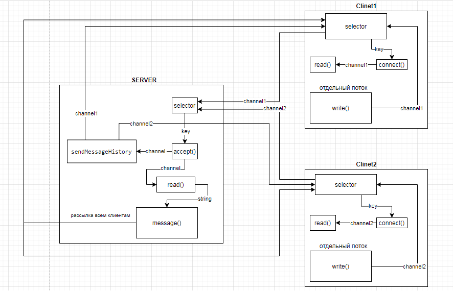

## Схема приложений


## Протокол обмена сообщениями
Сервер ожидает подключения клиента, после подключения
высылает ему историю сообщений и ожидает новой информации от 
клиента.

После получения новой информации сохраняет ее в файл и 
рассылает все подключенным клиентам.

## Архитектура сервера
Класс *SocketServer* реализует однопоточный nio сервер.
Содержит четыре основных метода:

*start()* - запускает сервер и управляет потоками клиентов;

*accept()* - регистрирует новых клиентов;

*read()* - читает данные от клиентов;

*message()* - рассылает всем клиентом сообщения полученные сервером.

### Работа построена следующим образом:

#### Метод *start()*
Инициализирует селектор *selector*, который 
принимает множество клиентов. Затем инициализируется серверный 
сокет *serverSocketChannel*, который запускает наш сервер по
адресу взятому из класса *Config*. 

Серверный сокет указывается как неблокирующий:  
```java
serverSocketChannel.configureBlocking(false);
```
и связывается с селектором:
```java
serverSocketChannel.register(this.selector, SelectionKey.OP_ACCEPT);
```
Затем в бесконечном цикле ждем подключение клиентов и по ключу 
определяем событие на которое подписался клиент.
Далее отправялем клиента в метод *accept()* или *read()*
в зависимости от ключа.

#### Метод accept() реализует регистрацию клиентов
Метод принимает ключ и по ключу инициализирует клиентский
канал: 
```java
ServerSocketChannel serverSocketChannel = (ServerSocketChannel) key.channel();
SocketChannel channel = serverSocketChannel.accept();
```
Данный канал cвязывается с селектором на режим чтения
и добавляется во множество активных каналов:
```java
channel.register(selector, SelectionKey.OP_READ);
session.add(channel);
```
Далее в методе вызывается метод *sendMessageHistory*
который читает данные из файла *file.log* и отправляет
клиенту, т.е. это отправка истории сообщений клиенту
при подключении к чату.

#### Метод read() реализует чтение данных из канала
В методе по ключу определяется канал, который
заполняет буффер своими данными:
```java
SocketChannel channel = (SocketChannel) key.channel();
channel.read(byteBuffer);
```
Затем буффер преобразуется в строку и данная строка 
передается методу для рассылки *message()*.

#### Метод message()
Метод принемает на вход строку, данную строку 
передает методу для записи в файл:
```java
writeToFile(s, FILE_PATH);
```
Затем рассылает эту строку всем активным клиентам:
```java
session.forEach(socketChannel -> {
    try {
        socketChannel.write(ByteBuffer.wrap(s.getBytes(charset)));
    } catch (IOException e) {
        e.printStackTrace();
    }
});
```

## Архитектура клиента
Класс *SocketClient* реализует nio клиент.
Содержит четыре основных метода:

*start()* - запускает клиент и регистрирует ключи;

*connect()* - реализует соединение с сервером;

*read()* - читает данные из канала;

*write()* - пишет данные в канал.

### Работа построена следующим образом:
#### Метод *start()*
Инициализирует селектор *selector*.
Затем инициализируется клиентский сокет *clientSocketChannel*, 
который подключается к серверу по адресу взятому из класса *Config*.
Затем в бесконечном цикле ждем событий на которое подписался клиент.
Далее отправялем клиента в метод *connect()* или *read()*
в зависимости от ключа.

#### Метод *connect()*
Метод из ключа получает канал.Если соединение успешно:
+ тогда создается новый поток для ввода информации пользователем
+ очищается файл истории сообщений
+ сокет настраивается на неблокирующую работу 
+ канал регистрируется на чтение:
```java
new Thread(new UserInputHander(this)).start();
FileChannel.open(Paths.get(FILE_PATH), StandardOpenOption.WRITE).truncate(0).close();
clientSocketChannel.configureBlocking(false);
client.register(this.selector, SelectionKey.OP_READ);
```
#### Метод *read()*
В методе полученные данные из канала читаются в буфер.
Буффер преобразуется в строку которая отправляется в 
метод *writeToFile* для записи в файл *file.log*.
И данная строка выводится в консоль.

#### Метод *write()*
Метод принимает строку введенную в консоли пользователем.
Данный метод вызывается из параллельного потока из класса
*UserInput*.

Данная строка записывается в буфер с помощью метода
*readyToSend* и затем записывается в канал который отправляет 
данные на сервер.
